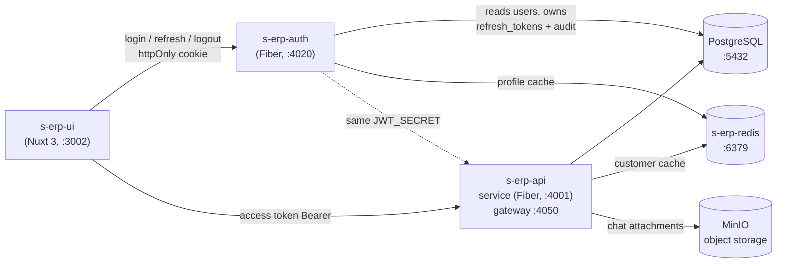

<h1 align="center">
    <br>
  Backend S-ERP-API
  <br>
</h1>

## 🚀 Quick Start
### Developement Environment
On `/` dir, Run `make copy-env`, Modify to suit your environment, focus on these key, you can leave others as it is. The key name is explanatory itself.
```bash
# MAIN APP PORT
GATEWAY_PORT=4050

# DATABASE
POSTGRES_PORT=5432
```

> Without docker, you need to install [air-verse](https://github.com/air-verse/air) to activate the hot reloading.

### 🐳 Docker :: Container Platform

[Docker](https://docs.docker.com/get-docker/) Install.

- On the root folder, Starts the containers in the background and leaves them running : `docker-compose -f docker/docker-compose-dev.yml up --build -d`
- Stops containers and removes containers, networks, volumes, and images : `docker-compose down`

## 🛎 Available Commands each Service

Change bash directory to each service.
> ${arg} means replace all of it match your args without space
- Run export path : `export PATH="$PATH:$(go env GOPATH)/bin"`
- Create mirgration : `make migrate-create name=${your_migration_name}`
- Run migration : `make migrate-up`
- Stepback migraiton: `make migrate-down`
- Generate proto file, leave the proto args blank if you want to generate all proto file: `make proto ${your-proto.proto}`. If its fail, run this command on specific service. for example, in /service/ run bash `export PATH="$PATH:$(go env GOPATH)/bin"`
- Create seeder : `make seed-create name=${your_seeder_name}`
- Run seeder : `make seed-run file=${your_seeder_name}.sql`

## 💎 The Package Features

<p>
  &nbsp;&nbsp;
  &nbsp;&nbsp;
  &nbsp;&nbsp;
&nbsp;&nbsp;
  &nbsp;&nbsp;
  &nbsp;&nbsp;
  &nbsp;&nbsp;
  &nbsp;&nbsp;
  
</p>
<p>
</p>

## 🧩 Microservices & Ecosystem

S-ERP is composed of several independently-deployable services that share a
single Postgres database and a single shared Redis cache. Each service lives in
its own repository/compose and joins the others over external Docker networks.



| Service | Repo | Port | Role |
|---|---|---|---|
| **s-erp-api** | this repo (`service/`, `gateway/`) | `4001` / gateway `4050` | Core ERP REST API, real-time chat, AI assistant |
| **s-erp-auth** | `../s-erp-auth` | `4020` | Central authentication (login, refresh, logout) |
| **s-erp-redis** | `../s-erp-redis` | `6379` | Standalone shared cache for all services |
| **s-erp-ui** | `../s-erp-ui` | `3002` | Nuxt 3 + Vuetify frontend |

### 🔐 s-erp-auth — authentication microservice

A standalone Fiber service that owns login for the whole ecosystem, so users
**log in once and stay signed in across apps**.

- **Shared identity, no code change in the API** — it signs **HS256 access
  tokens with the same `JWT_SECRET`** and the same claim shape
  (`user_id`, `bid`, `roles`, `permissions`, `exp`) that `s-erp-api`'s JWT
  middleware already validates. Keep `JWT_SECRET` **byte-identical** in both.
- **Short access + long refresh** — 15-minute access token; **30-day refresh
  token** delivered only as an `HttpOnly` cookie, stored **hashed** (SHA-256),
  **rotated on every use** with **reuse detection** (a replayed refresh token
  revokes the whole token family).
- **Shared DB** — reads the existing `users` table; owns two of its own tables,
  `refresh_tokens` and `auth_audit_logs` (created idempotently on boot).
- **Redis profile cache** — the logged-in user's profile is cached on
  login/refresh and evicted on logout (`s-erp:auth:profile:<id>`).
- **OWASP hardening** — bcrypt, strict CORS allowlist + credentials, Helmet
  security headers, per-IP login rate limit, uniform "invalid credentials"
  (no user enumeration), JWT algorithm pinning, audit logging.

Endpoints (base `/v1/auth`): `POST /login`, `POST /refresh`, `POST /logout`,
`GET|POST /me`, `POST /profile`, `GET /healthz`.

### 🧠 s-erp-redis — shared cache microservice

A standalone Redis instance in its own project. It owns the external network
`s-erp-redis-network`; every consumer joins that network and reaches it at
`redis:6379`. Keys are namespaced per service — `s-erp:<service>:<domain>:<id>`
(e.g. `s-erp:api:customer:42`, `s-erp:auth:profile:42`).

- **Dev** publishes `localhost:6379` for `redis-cli` / host-run services.
- **Prod** keeps Redis network-internal (no host port) and **requires**
  `REDIS_PASSWORD`. This value **must match** every consumer's `REDIS_PASSWORD`.

`s-erp-api` connects **best-effort** (`InitRedisClientSafe` — never fatal), so
the API keeps serving from Postgres if Redis is down. `GetCustomerByID` uses a
**read-through cache** (`s-erp:api:customer:<id>`, 10-min TTL) that is
**invalidated on update/delete/restore**.

### ▶️ Bring-up order

Each of `s-erp-api` and `s-erp-redis` owns a network the others join, so start
them first:

```bash
# 1) shared cache (owns s-erp-redis-network)
cd ../s-erp-redis && docker compose -f docker-compose.dev.yml up -d

# 2) core API + Postgres (owns s-erp-api_s-erp-api-network)
cd ../s-erp-api  && docker compose -f docker/docker-compose-dev.yml up -d --build

# 3) auth service (joins both networks above)
cd ../s-erp-auth && docker compose -f docker-compose.dev.yml up -d --build

# 4) frontend
cd ../s-erp-ui   && bun install && bun dev
```

## ✨ Application Features (s-erp-api)

- **Real-time chat** (WebSocket hub + REST): direct & group conversations with
  roles (owner/admin/member), invite / kick / leave, typing indicators, read
  receipts with timestamps, reply, `@mentions`, emoji reactions, Discord-style
  threads, delete-for-me / delete-for-everyone, and **MinIO-backed attachments**
  (images, video, voice notes, documents) with an image lightbox + captions.
- **AI assistant contact** — a special `is_ai` user you can chat with. It replies
  in **Markdown** (rendered richly in the UI) and is designed to answer questions
  about ERP data. Provider is pluggable via `AI_PROVIDER`: a **local GPU**
  OpenAI-compatible endpoint (default), a **hosted endpoint** with the local GPU
  as automatic fallback (`remote`), or **Claude** (`anthropic-sdk-go`) — see the
  `AI_*` keys in `.env`.
- **Redis caching** for hot read paths (customer detail), see s-erp-redis above.
- **Object storage** — MinIO for chat attachments (`MINIO_*` keys in `.env`).

> **Env note:** `service/.env` is a symlink to the canonical `docker/.env`
> (single source of truth). For running the Go service directly on your host,
> put host-only overrides (e.g. `POSTGRES_HOST=localhost`) in
> `service/.env.local` — it is loaded first and wins locally, while the
> container keeps using the service-name hosts.

## 📔 Notes & Issues

#### dial tcp: lookup postgres: no such host
Change the makefile DB_HOST to `localhost` if run in local env, when running on docker, change it to `postgres`, make sure no space in the value.

#### run multiple seeder in one execution
You can run multiple seeder references in the seeder_controller.go file with password on body payload = env of POSTGRES_PASSWORD.

#### error running migration fix migration
Change the 'version' column name on schema_migrations to latest succeed migration, change the 'dirty' column to false, then run the migration again

#### error function gen_salt(unknown) does not exist, postgre extensions
`CREATE EXTENSION IF NOT EXISTS pgcrypto;`

### 📗 API Document
All endpoints stored in `S-ERP-API.postman_collection.json`.
Postman credentials:
- Email: `yubi@email.com`
- Password: `erppostman1!`

### 🖥️ Prometheus & Grafana
- Grafana will fail at first run, because user credentials need to be created manually in the postgres database.
`CREATE ROLE grafana WITH LOGIN PASSWORD 'secret';`
`CREATE DATABASE grafana;`
- Login with the user and password. The default user and password is `admin` and `admin`.
- Dashboard ID
  - PostgreSQL: `9628`
  - Node Exporter: `1860`
  - HTTP Request: `S-ERP-API.postman_collection.json`
- Use `vegeta` to generate the load test. look up `target.txt` for the target URL, then run `vegeta attack -targets=target.txt -rate=1000 -duration=30s -output /dev/null`, change the rate and duration as you need.
- Use `k6` to execute the test. look up `load-test` folder for the script, then run `k6 run script.js`, change the script as you need.

### Scheduler
Use `.service` & `.timer` on /scripts, change the `ExecStart` to your directory, and `User` to your user. To run the scheduler on linux, you need to create a systemd service and timer:
```bash
# Create the service file
sudo nano /etc/systemd/system/stock_daily.service
sudo nano /etc/systemd/system/stock_daily.timer

# Reload systemd
sudo systemctl daemon-reload

# Enable and start both the service and timer
sudo systemctl enable stock_daily.service
sudo systemctl enable stock_daily.timer
sudo systemctl start stock_daily.timer

# Verify the status
systemctl status stock_daily.timer
systemctl status stock_daily.service

# View logs
journalctl -u stock_daily.service -f
```

### Auto Restart Service
To make your script persistent even after a system restart, you should run it as a systemd service
```bash
# Create the service file
sudo nano /etc/systemd/system/auto-restart-s-erp-api.service
```

Then, copy and paste the following content into the file:

```bash
[Unit]
Description=Auto Restart s-erp-api Docker Service on Healthcheck Failure
After=network.target docker.service
Requires=docker.service

[Service]
Type=simple
ExecStart=/home/nibros/projects/s-erp-api/scripts/auto_restart_service.sh
Restart=always
User=nibros
Environment=PATH=/usr/bin:/usr/local/bin
WorkingDirectory=/home/nibros/projects/s-erp-api/scripts

[Install]
WantedBy=multi-user.target
```

Reload systemd and enable the service,
```bash
sudo systemctl daemon-reload
sudo systemctl enable auto-restart-s-erp-api.service
sudo systemctl start auto-restart-s-erp-api.service
```

To check the status of the service, you can use:
```bash
systemctl status auto-restart-s-erp-api.service
```


<h1 align="center">
    <br>
  Features
  <br>
</h1>

Feel free to ask if you have any questions or need more details!

