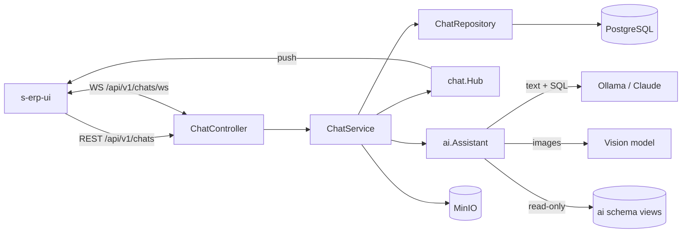
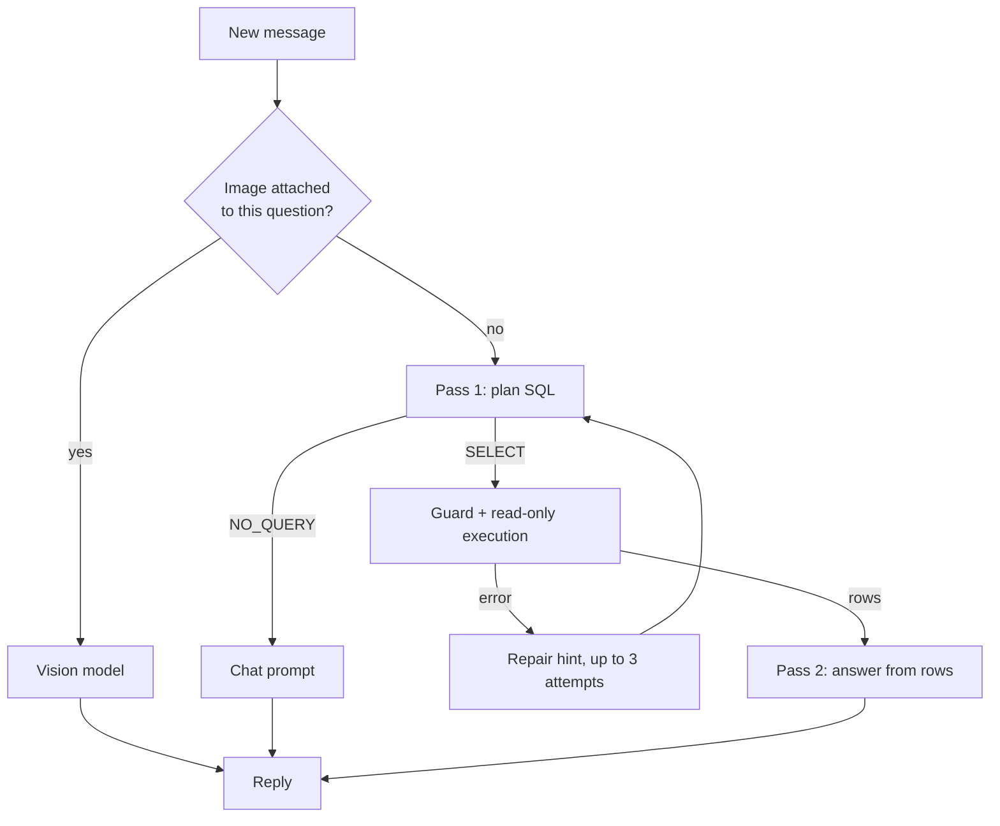
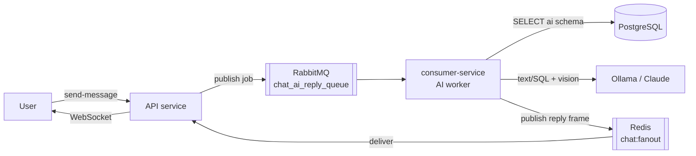

# Chat & AI Assistant

Real-time chat for S-ERP: direct messages, groups, threads, reactions, mentions,
file attachments, presence — plus a built-in AI assistant that answers questions
from live ERP data and reads images the user sends.

- **Transport** — REST for anything that writes; a websocket for everything the
  server pushes back.
- **Persistence** — PostgreSQL, alongside the rest of the ERP schema.
- **Attachments** — MinIO object storage, served to clients as presigned URLs.
- **AI** — a local OpenAI-compatible model server (Ollama) by default, or Claude.

---

## Contents

- [Architecture](#architecture)
- [Data model](#data-model)
- [REST API](#rest-api)
- [WebSocket](#websocket)
- [Behaviour](#behaviour) — roles, deletion, unread, presence
- [Attachments](#attachments)
- [The AI assistant](#the-ai-assistant)
  - [How a reply is produced](#how-a-reply-is-produced)
  - [Dispatching replies: in-process vs queued](#dispatching-replies-in-process-vs-queued)
  - [Database access and its security model](#database-access-and-its-security-model)
  - [Prompting](#prompting)
  - [Images](#images)
  - [When things fail](#when-things-fail)
- [Configuration](#configuration)
- [Operations](#operations)
- [Testing](#testing)
- [Known limitations](#known-limitations)

---

## Architecture



| Package | Role |
| --- | --- |
| [`internal/controller/rest/chat_controller.go`](../service/internal/controller/rest/chat_controller.go) | HTTP handlers, websocket upgrade, read/write pumps |
| [`internal/service/chat_service.go`](../service/internal/service/chat_service.go) | Authorization, validation, broadcasting, AI orchestration |
| [`internal/repository/chat_repository.go`](../service/internal/repository/chat_repository.go) | SQL |
| [`internal/chat/hub.go`](../service/internal/chat/hub.go) | In-memory registry of live sockets per user |
| [`internal/ai/`](../service/internal/ai/) | Providers, SQL planning, guard, vision |

The hub is **in-process** by default: a single service instance is assumed, and
with several replicas a user connected to instance A would not receive events
broadcast by instance B. Setting `CHAT_AI_QUEUE=true` switches the hub to a
**Redis fan-out** (`Hub.EnableRedis`) — `SendToUsers` publishes each frame to the
`chat:fanout` channel and every instance's subscriber delivers to its own
sockets — which both makes the hub multi-instance safe and lets the out-of-process
AI worker deliver replies. See
[Dispatching replies](#dispatching-replies-in-process-vs-queued).

---

## Data model

Created by migrations `20260713000001`–`20260713000009`. Every table is
soft-deleted via `deleted_at`.

| Table | Purpose |
| --- | --- |
| `conversations` | A thread. `type` is `direct`, `group` or `thread`. |
| `conversation_participants` | Membership, `role`, and `last_read_message_id`. |
| `messages` | `content`, `type` (`text`/`system`), `reply_to_id`, `edited_at`, `deleted_for_all`. |
| `message_attachments` | One row per uploaded file; `kind` is `image`/`video`/`voice`/`document`. |
| `message_reactions` | Unique on `(message_id, user_id, emoji)`. |
| `message_mentions` | Users @-mentioned in a message. |
| `message_hides` | Per-user "delete for me". |

Two constraints carry real weight:

- **`conversations.direct_key`** holds `"minUserId:maxUserId"` under a unique
  partial index. A 1-1 conversation therefore cannot be duplicated, even under a
  race between two clients opening the same chat.
- **`idx_messages_conversation_id_id`** on `(conversation_id, id DESC)` is what
  makes keyset pagination cheap — history is paged by `before_id`, never
  `OFFSET`.

Threads reuse `conversations` with `parent_id` and `root_message_id` set, so
every feature that works on a conversation works on a thread for free.

---

## REST API

All routes are under `/api/v1/chats` and require the JWT middleware. Every
endpoint is `POST`, including reads — consistent with the rest of this codebase,
where filters travel in the body.

| Endpoint | Purpose |
| --- | --- |
| `/start-conversation` | Open or create a direct conversation with another user |
| `/start-ai` | Open or create the direct conversation with the AI assistant |
| `/index-conversation` | The caller's conversation list, with unread counts |
| `/index-message` | Page of history (`before_id`, `limit`; default 30, max 100) |
| `/send-message` | Send text and/or attachments; supports `reply_to_id`, `mention_ids` |
| `/read-conversation` | Advance the read pointer |
| `/upload` | Multipart upload; returns an `object_key` to attach |
| `/edit-message`, `/delete-message` | Edit or delete (`scope`: `me` or `everyone`) |
| `/react-message`, `/unreact-message` | Toggle an emoji reaction |
| `/create-group`, `/index-member`, `/add-member`, `/remove-member`, `/set-member-role`, `/leave-conversation` | Group management |
| `/create-thread`, `/index-thread` | Threads |
| `/show-conversation`, `/update-conversation` | Conversation metadata |
| `/show-profile` | A user's profile card, optionally scoped to a conversation |

Message content is trimmed and capped at **4000 characters**. A message may have
empty content **only** when it carries attachments.

---

## WebSocket

`GET /api/v1/chats/ws?token=<jwt>`

The socket is mounted **before** the JWT middleware ([`routes.go`](../service/internal/routes/routes.go))
because browsers cannot set an `Authorization` header on a websocket handshake.
`WSUpgradeGuard` authenticates the `token` query parameter instead, falling back
to the header for non-browser clients.

The connection is **receive-first**: the server pushes, and message creation
stays on REST where it is validated, traced and transactional. The only frame the
client may send is a typing signal:

```json
{ "type": "typing", "conversation_id": 12 }
```

### Server events

Every frame is `{ "type": ..., "payload": ... }`.

| Type | Sent when |
| --- | --- |
| `message` | A message was created (including the assistant's reply) |
| `message_edited` | A message was edited |
| `message_deleted` | A message was deleted for everyone |
| `reaction_updated` | Reaction totals changed |
| `typing` | Someone is typing — including the assistant while it works |
| `read` | A participant advanced their read pointer |
| `presence` | A contact came online or went offline |
| `presence_snapshot` | Sent once on connect: which contacts are already online |
| `conversation_updated` | Membership, roles or title changed |
| `thread_created` | A thread was branched off a message |

### Connection handling

| Setting | Value |
| --- | --- |
| Ping period / pong wait | 54s / 60s |
| Write deadline | 10s |
| Max inbound frame | 8 KiB |
| Send buffer per client | 64 frames |

Fan-out is **best-effort**: a client whose buffer is full has that frame dropped
rather than stalling delivery for everyone else. Clients should treat the socket
as a live hint and reconcile against REST, not as a guaranteed log.

---

## Behaviour

### Roles and permissions

| Action | Owner | Admin | Member |
| --- | --- | --- | --- |
| Send, react, reply, thread | ✅ | ✅ | ✅ |
| Add members | ✅ | ✅ | ❌ |
| Remove members | ✅ | members only | ❌ |
| Change roles | ✅ | ❌ | ❌ |
| Rename / re-describe | ✅ | ✅ | ❌ |
| Delete anyone's message | ✅ | ✅ | own only |

The owner can never be removed. An owner may only leave once an admin exists —
the earliest-joined admin is promoted automatically. Setting a member to `owner`
transfers ownership and demotes the previous owner to admin.

### Deletion

- `scope: "me"` writes to `message_hides`; the row stays for everyone else.
- `scope: "everyone"` sets `deleted_for_all` and **purges the attachment objects
  from MinIO** (best-effort). Allowed for the sender, or a group owner/admin.

### Unread and presence

Unread counts derive from `last_read_message_id` per participant. Presence is
whatever the hub currently holds — it is process-local and resets when the
service restarts, which is correct, since the sockets die with it.

---

## Attachments

1. `POST /chats/upload` (multipart) → stored under
   `chat/YYYY/MM/<uuid><ext>`, capped at **50 MiB**. The response carries an
   `object_key` and a presigned URL for immediate preview.
2. `POST /chats/send-message` with that `object_key` in `attachments[]`.

`kind` is derived from the content type: `image/*` → `image`, `video/*` →
`video`, `audio/*` → `voice`, everything else → `document`. Documents get a
presigned URL with `Content-Disposition: attachment`; media is inline.

If MinIO is unreachable at startup the service still boots — chat works and
uploads return 503. This is deliberate: object storage should not gate messaging.

---

## The AI assistant

The assistant is an ordinary user row flagged `is_ai` (migration
`20260713000008`), so it reuses conversations, participants, messages and the
socket without special cases. `POST /chats/start-ai` opens the direct
conversation with it.

When a user sends a message into a direct conversation with that user, the
service generates a reply **in the background** — the send returns immediately
and the answer arrives over the socket. A `typing` event is re-emitted every 3
seconds while the model works, so the UI shows the assistant typing.

### How a reply is produced



Two passes rather than native tool-calling, because it works on any
OpenAI-compatible endpoint regardless of whether the served model supports tool
schemas, and it keeps generated SQL somewhere it can be vetted and logged before
it reaches the database.

The last **20 messages** form the context. The planner additionally receives the
recent turns so a follow-up like *"no i dont want navigate, i want the number"*
resolves against what came before.

### Dispatching replies: in-process vs queued

Generation is slow (seconds to minutes) and the model server has limited
parallelism, so *how* a reply is dispatched matters under load. There are two
modes, selected by `CHAT_AI_QUEUE`.

**In-process (default, `CHAT_AI_QUEUE=false`).** `send-message` runs the
generation in a **bounded** goroutine — capped by `AI_MAX_CONCURRENCY` (a
semaphore) so a burst of users can no longer spawn unbounded goroutines all
blocked on the model. When the pool is full the user gets a *"the assistant is
busy, try again"* message instead of a silently dropped request. Delivery is the
local hub. Simple, single-process; no broker involved.

**Queued (`CHAT_AI_QUEUE=true`).** Generation moves off the API entirely to the
consumer-service, so a spike in AI usage never competes with normal ERP request
handling. Two brokers, each doing what it is good at:



1. `send-message` persists the user's message, returns immediately, and
   **publishes a job** `{conversation_id, ai_user_id, trigger_message_id}` to the
   durable **RabbitMQ work queue**. The API and the worker both declare the queue
   with identical arguments (`DeclareAIReplyQueue`), so a job is never published
   to a missing queue (the default exchange would silently drop it).
2. The **worker** (`prefetch=1`) pulls one job and runs the *same* generation
   logic — plan SQL → guard/execute → answer, or the vision path — then writes
   the assistant's message to Postgres.
3. The worker holds no sockets, so it **publishes the reply frame to Redis**
   channel `chat:fanout` as `{user_ids, payload}`.
4. Every **API instance subscribes** to that channel and delivers the frame to
   whichever of the target users it holds a live socket for. The *typing*
   indicator rides the same path.

**Why a work queue *and* pub/sub.** RabbitMQ is a **work queue** — competing
consumers, durability, backpressure — it bounds concurrency and lets a job
survive an API restart (an in-process goroutine would just die, leaving the user
with no reply). Redis pub/sub is **fan-out** — it carries the async result back
to the one instance that owns the socket. Using the queue for delivery, or
pub/sub for dispatch, would each be the wrong tool.

**Concurrency & scaling.** `prefetch=1` means one generation per worker at a
time, so total AI concurrency equals the number of consumer-service replicas —
scale by adding replicas (`deploy.replicas`, or more containers), sized to the
model server's real parallelism. Bursts wait in the queue; nothing piles up in
the API.

**Idempotency & failures.** `RunAIReply` is idempotent — a redelivered job whose
reply already exists (an assistant message after `trigger_message_id`) is a
no-op. A **model failure** posts an apology and *acks* (no retry; the user got an
answer); a genuine **infra error** (e.g. Postgres unreachable) is *retried once*,
then dead-lettered to `chat_ai_reply_dlq`; an **unparseable job** dead-letters
immediately.

**Fallbacks.** If publishing the job fails (broker down), the API falls back to
the bounded in-process path, so the assistant never goes silent just because
RabbitMQ is unavailable. If Redis is down while queued, the worker's reply is
still saved to Postgres — clients reconcile it on their next history fetch, they
just don't get the live push.

**Bonus: multi-instance.** Turning the queue on also enables the Redis fan-out on
the hub (`Hub.EnableRedis`), which routes **all** chat broadcasts through Redis.
That removes the old single-instance-hub limitation for chat in general — a user
on API instance A now receives events originated on instance B.

### Database access and its security model

The assistant writes its own `SELECT` statements, so the boundary is enforced by
**PostgreSQL**, never by inspecting the SQL. Migration
[`20260713000009`](../service/internal/database/migrations/20260713000009_ai_readonly_views.up.sql)
creates:

- **schema `ai`** — 15 curated views over the business tables. Each pre-filters
  `deleted_at IS NULL` and joins human-readable names in (`customer_name`,
  `product_name`, `io_type`, `direction`), so the model never has to know that
  `mix_values` group 36 means inbound.
- **role `ai_readonly`** — `NOLOGIN`, granted `SELECT` on those views and nothing
  else. Views execute with their owner's privileges, so the role reads them while
  holding **no privilege on `public`**.

Every generated query runs in one read-only transaction that first does
`SET LOCAL ROLE ai_readonly`, with `statement_timeout = 10s` and
`search_path = ai`. `NOLOGIN` means there is no second credential to leak or
rotate, and `SET LOCAL` cannot outlive its transaction.

Verified denials:

| Attempt | Result |
| --- | --- |
| `SELECT username, password FROM users` | permission denied for table users |
| `SELECT content FROM messages` | permission denied for table messages |
| `refresh_tokens`, `hr_employees`, `pg_authid` | permission denied |
| `CREATE TABLE …` | cannot execute in a read-only transaction |
| `pg_read_file('/etc/passwd')`, `COPY … TO` | permission denied |

On top of that, [`sqlguard.go`](../service/internal/ai/sqlguard.go) accepts only
a single `SELECT`/`WITH`, rejects comments and chained statements, and nests every
query inside `SELECT * FROM (…) AS ai_result LIMIT 200`. That wrap is not only a
row cap: it makes statement chaining a **syntax error**, which matters because
lib/pq sends argument-less queries over the simple protocol, where a `;` would
otherwise start a second statement.

> **Not enforced: per-user permissions.** Anyone who can chat with the assistant
> can read any row in those views, regardless of their role or branch. This sits
> below the app's own RBAC. Before exposing it to branch-scoped users, queries
> need scoping to the asking user — the assistant already receives their id.

### Prompting

Four layers, in [`ai.go`](../service/internal/ai/ai.go) and
[`dataschema.go`](../service/internal/ai/dataschema.go):

| Layer | Job |
| --- | --- |
| `DefaultSystemPrompt` | Persona, tone, the real menu names, and what it must not claim |
| `schemaCard` | Tables, columns, and the semantics no schema can express |
| `answerPrompt` | How to state figures once rows are in hand |
| `styleReminder` | Re-stated on the newest user turn, conversational path only |

Two mechanisms exist because prompting alone was not enough:

- **History laundering** — a small model imitates its own previous replies far
  more strongly than it follows the system prompt. `stripCodeBlocks` removes
  fenced code from stored assistant turns, so one early SQL-heavy answer does not
  keep reproducing itself.
- **The style reminder's position** — restating the rules at the *end* of the
  context beats a system prompt sitting behind a long history. It is applied only
  on the conversational path; attaching it to an answer written from real query
  results would tell the model to disown the figures it was just handed.

The schema card carries the traps that are invisible in `information_schema`:
`order_at` is the business date and `created_at` is not; `grand_total` already
includes tax; `purchase_orders.customer_id` is the supplier; status values are
upper case; a ranking needs `GROUP BY … ORDER BY … LIMIT 1` and never `MAX(date)`.

Prefer encoding context in the **schema** over explaining it in the prompt. The
views' `product_id`/`product_name` aliases exist because the model kept using
those names on the `products` table however firmly it was told not to — one alias
column ended a failure the prompt could not.

### Images

Sending an image is optional and never sticky. Routing looks only at the
**unanswered run of user turns** — pasting a screenshot then typing the question
arrives as two consecutive user messages and both belong to the same question,
but once answered, the next question goes back to the data path with the stale
image stripped.

An image turn skips SQL planning entirely: the planner is a separate text-only
model that cannot see the picture.

| Guard | Value | Why |
| --- | --- | --- |
| Longest side | 1024px | Cost is pixels, not bytes — a 4K screenshot is ~13k tokens against an 8192 context |
| Images per reply | 3 newest | Each is re-encoded on every request |
| Max source size | 6 MiB | Larger is skipped, not stalled |
| History on image turns | 6 turns | Leaves room for the image itself |

Downscaling uses CatmullRom resampling, and PNGs stay PNG — a cheaper filter or a
lossy re-encode smears small digits into ones the model reads wrong. If a server
still reports an overflow, the request is retried once with only the turn holding
the image.

### When things fail

| Failure | Behaviour |
| --- | --- |
| Generated SQL rejected or errors | Retried up to 3× with an error-specific correction (`repairHint`) |
| Planner returns `NO_QUERY` | Answers conversationally; states it has not checked rather than inventing figures |
| Model unreachable / empty reply | Posts an apology message; the real cause goes to the log |
| Context overflow on an image | Retried with history shed |
| `ai` schema missing | Degrades to plain chat; the error names the migration |

Every data answer logs its query, so a suspicious figure can always be traced:

```bash
docker logs s-erp-api-service-1 | grep "chat AI"
```

---

## Configuration

| Variable | Default | Purpose |
| --- | --- | --- |
| `AI_PROVIDER` | `local` | `local`, `remote`, or `claude` |
| `AI_LOCAL_BASE_URL` | `http://localhost:11434/v1` | OpenAI-compatible endpoint |
| `AI_LOCAL_MODEL` | `llama3.1` | Text and SQL model |
| `AI_LOCAL_VISION_MODEL` | *(empty)* | Vision model; empty disables image reading |
| `AI_LOCAL_TEMPERATURE` | `0.2` | Low on purpose — higher produces SQL that does not parse |
| `AI_LOCAL_API_KEY` | *(empty)* | If the endpoint requires one |
| `AI_REMOTE_BASE_URL` | `https://ai.nibros.space/v1` | Hosted OpenAI-compatible endpoint (`AI_PROVIDER=remote`) |
| `AI_REMOTE_MODEL` | `ai/gpt-5.6-luna,bbai` | Comma-separated model chain — first is primary, the rest are same-endpoint fallbacks |
| `AI_REMOTE_VISION_MODEL` | *(empty)* | Hosted vision model; empty disables image reading on the remote path |
| `AI_REMOTE_TEMPERATURE` | `0.2` | Same reasoning as `AI_LOCAL_TEMPERATURE` |
| `AI_REMOTE_API_KEY` | *(empty)* | Bearer key for the hosted endpoint |
| `AI_SYSTEM_PROMPT` | *(built-in)* | Overrides the persona without a rebuild |
| `ANTHROPIC_API_KEY`, `AI_CLAUDE_MODEL` | — | Used when `AI_PROVIDER=claude` |
| `MINIO_*` | — | Object storage for attachments |
| `CHAT_AI_QUEUE` | `false` | `true` dispatches AI replies to the consumer-service via RabbitMQ + Redis fan-out; `false` generates them in-process |
| `AI_MAX_CONCURRENCY` | `2` | Concurrency cap for the in-process (fallback) path — set to the model server's parallelism |
| `REDIS_*` | — | Shared Redis; also the chat fan-out transport when `CHAT_AI_QUEUE=true` |

When `CHAT_AI_QUEUE=true`, set it on **both** the `service` (API) and the
`consumer-service` (worker) — a mismatch means jobs are published with no
consumer, or vice-versa. The `consumer-service` must also share a network with
Redis (and the model server, if it is a local Ollama): the compose files add
`s-erp-redis-network` (dev also adds `localai-network`) and give the worker the
DB / Redis / MinIO / AI config via `.env`.

Current local setup: `qwen2.5:7b-instruct-q4_K_M` for text and SQL,
`qwen2.5vl:7b` for images.

Because the service reads these through `env_file`, **adding a new variable needs
the container recreated**, not just Air's hot reload:

```bash
docker compose -f docker/docker-compose-dev.yml up -d --no-deps --force-recreate service
```

The service container must share a network with the model server. In dev it
joins Ollama's external network (`localai-network` → `localai_default`), so
`ollama:11434` resolves; Ollama publishes only on host loopback, which a
container cannot otherwise reach.

---

## Operations

**Migrations.** `20260713000001`–`20260713000009`. The last one is idempotent
(`IF NOT EXISTS`, `CREATE OR REPLACE`) and safe to re-run.

**Models.**

```bash
docker exec ollama ollama pull qwen2.5:7b-instruct-q4_K_M
docker exec ollama ollama pull qwen2.5vl:7b
```

**Startup check.** One line confirms the whole AI configuration:

```
Chat AI assistant provider: local (http://ollama:11434/v1, model=qwen2.5:7b-instruct-q4_K_M, vision=qwen2.5vl:7b) + ERP data
```

`no vision model` means images are disabled; `(no database access)` means the
`ai` schema is unreachable.

### Troubleshooting

| Symptom | Cause | Fix |
| --- | --- | --- |
| "Sorry, I couldn't reach the AI service" | Model server unreachable | Check `AI_LOCAL_BASE_URL` resolves *from the container*; with `AI_PROVIDER=remote` also check `AI_REMOTE_BASE_URL` / `AI_REMOTE_API_KEY` — the local endpoint is the final fallback |
| `ai_readonly role unavailable` | Migration not applied | Apply `20260713000009` |
| `exceeds the available context size` | Oversized image or long history | Should be handled automatically; raise `OLLAMA_CONTEXT_LENGTH` for headroom |
| Assistant answers from an old screenshot | — | Fixed: routing looks only at the unanswered turns |
| Answers are navigation advice, not figures | Planner returned `NO_QUERY` | Check the logged query; the question may need a schema-card note |
| `ollama pull` fails with a DNS error | Docker's embedded resolver has no upstream | Add a `dns:` entry to the Ollama stack's compose file |
| Queued AI replies never appear | `CHAT_AI_QUEUE` mismatched, or worker can't reach Redis/model | Set the flag on **both** `service` and `consumer-service`; check the consumer joined `s-erp-redis-network` (+ `localai-network` in dev). Watch depth at the RabbitMQ UI (`:15672`, queue `chat_ai_reply_queue`) |
| Reply saved but not pushed live | Redis down while queued | Client sees it on next history fetch; restore Redis to re-enable the live push |
| Jobs pile up in `chat_ai_reply_dlq` | Poison jobs or repeated infra failure | Inspect a dead-lettered message; the worker logs the cause (`chat AI worker:`) |

---

## Testing

```bash
cd service && go test ./internal/ai/ -v
```

31 tests, no network or database required. They cover the SQL guard (chained
statements, `RESET ROLE`, `set_config`, comment smuggling, `pg_authid`, plus the
false positives a naive keyword blocklist trips on — `created_at`, `updated_at`,
`OFFSET`), image bounding, context-overflow detection, and the routing rules.

The interesting cases are regressions worth keeping:

- A question after an image must return to the data path.
- An image followed by a text message is still one image question.
- Merging consecutive user turns must carry images across, or the picture
  vanishes the moment a follow-up is sent.
- The style reminder must never leak into the SQL planning pass.

---

## Known limitations

- **The hub is single-instance _unless_ `CHAT_AI_QUEUE=true`.** In the default
  in-process mode multiple API replicas don't share socket events; enabling the
  queued path turns on the Redis fan-out, which fixes this. See
  [Dispatching replies](#dispatching-replies-in-process-vs-queued).
- **No per-user scoping on AI data access** — see the note above.
- **Images and data don't combine.** "Is this product in stock?" over a photo
  reads the photo but will not cross-reference the database; that needs a
  two-hop flow (identify from image, then query).
- **A follow-up about an image without re-attaching it** no longer sees the
  picture. It often still answers from its own earlier description — reading its
  notes rather than looking again.
- **Small-model accuracy.** The guardrails make wrong answers rare, not
  impossible. Every answer logs its query for exactly this reason. A larger
  model needs far fewer of the rules in `dataschema.go`; the semantic notes stay
  necessary at any size.
